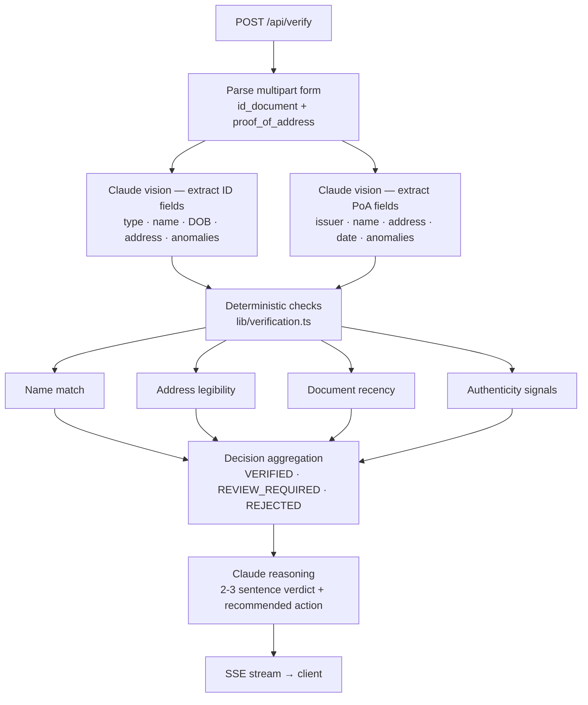

# KYC Address Verifier

AI-powered KYC address verification for Nigerian fintechs. Upload an identity document and a proof of address — the system extracts structured fields from both using Claude vision, runs four deterministic compliance checks, and returns a structured verdict with auditable reasoning in under 10 seconds.

**Live demo:** https://kyc-address-verifier.vercel.app

> [screenshot: VERIFIED verdict — to be added]

**Built in 3 days as part of an application for Senior PM, New Product Launch at OkHi.**

---

## Why I built this

Nigerian fintechs are required by the Central Bank of Nigeria to verify customer addresses before granting Tier 2 and Tier 3 account privileges — higher transaction limits, lending products, and cross-border transfers. In practice, this means compliance officers manually comparing identity documents against utility bills across thousands of onboardings daily. It doesn't scale, and it introduces human error into decisions that carry regulatory weight.

OkHi has built the physical infrastructure to verify addresses on the ground. This prototype explores the complementary layer: automated document cross-checking that produces a structured, auditable verdict a compliance team can act on or escalate — with the reasoning already written. Rather than replacing human judgment, it compresses the first-pass review from minutes to seconds and makes the decision trail legible to regulators.

---

## Architecture



Three model calls instead of one: extraction is structured and benefits from focused prompts; reasoning is generative and gets the check results as context. The separation keeps each call cheap and the system easy to audit — every decision traces back to discrete, named checks.

The client reads pipeline stage events over Server-Sent Events so the progress indicator advances in real time rather than blocking on a single round-trip.

---

## Sample verdicts

**VERIFIED**
```json
{
  "decision": "VERIFIED",
  "confidence": 0.92,
  "reasoning": "The NIN slip and IKEDC utility bill belong to the same individual. The abbreviated name on the bill (O. A. ADEYEMI) is consistent with the full name on the ID — a common pattern on Nigerian utility accounts. The address matches across both documents and the bill is within the required 90-day window.",
  "recommended_action": "Approve KYC tier upgrade. No manual review required."
}
```

**REVIEW_REQUIRED**
```json
{
  "decision": "REVIEW_REQUIRED",
  "confidence": 0.68,
  "reasoning": "The name on the utility bill ('O. A. ADEYEMI') partially matches the driver's license ('OLUMIDE ADENIYI JAMES ADEYEMI') — surname present, first name reduced to an initial. The bill date of 11 January 2026 is 110 days old, exceeding the 90-day threshold but within the 180-day secondary limit. Either factor alone would trigger review; together they warrant manual confirmation before approval.",
  "recommended_action": "Escalate to manual review. Request customer to provide a more recent proof of address or a second document with full name."
}
```

**REJECTED**
```json
{
  "decision": "REJECTED",
  "confidence": 0.31,
  "reasoning": "The name on the DSTV bill ('JOHN ADEBAYO SMITH') does not match the name on the NIN slip ('CHIDINMA UCHENNA OKONKWO') — no shared tokens. The bill address ('Block 5 Flat 2') is incomplete and fails legibility checks. Additionally, the AI flagged two anomalies on the NIN slip: a blurry ID number field and compression artefacts inconsistent with official print quality. All four checks failed independently.",
  "recommended_action": "Reject KYC submission. Request a utility bill in the applicant's name with a complete address, issued within the last 90 days."
}
```

---

## Stack

| Layer | Choice |
|---|---|
| Framework | Next.js 16 App Router, TypeScript |
| Styling | Tailwind CSS |
| AI | Anthropic Claude Sonnet 4.5 (vision + reasoning) |
| Hosting | Vercel |

---

## Local setup

```bash
git clone https://github.com/oludami23/kyc-address-verifier.git
cd kyc-address-verifier
npm install

# Add your Anthropic API key
echo "ANTHROPIC_API_KEY=sk-ant-..." > .env.local

npm run dev
# → http://localhost:3000
```

The three demo scenario buttons work without an API key (they use mock extractions and run one real reasoning call). Real document upload requires a valid key.

---

## Known limitations

- **Name abbreviation edge cases:** The name-match algorithm handles initial abbreviations (O. A. ADEYEMI → OLUMIDE ADENIYI ADEYEMI) and token reordering. It does not handle informal shortenings where the short form is not a prefix of the full name — e.g. "TUNDE" will not match "BABATUNDE" since neither is a prefix of the other. A phonetic similarity layer is on the v2 roadmap.
- **PDF not supported:** The system accepts JPG and PNG only. PDF uploads are rejected with a clear error message. PDF-to-image conversion is planned for v2.
- **Single upload per verification:** Each run takes one ID document and one proof of address. Batch processing for compliance teams reviewing multiple submissions is a v2 feature.
- **No document liveness check:** The system reads images as presented. It cannot detect whether a document was photographed from a screen rather than held in hand.

---

## v2 roadmap

- **PDF support** — server-side conversion before vision extraction
- **NIMC API integration** — verify NIN numbers against the national identity database in real time
- **BVN cross-check** — validate bank statement submissions against the Bank Verification Number registry
- **Audit log** — tamper-evident verdict storage with full extraction payloads for regulatory review
- **Batch processing** — queue-based pipeline for compliance teams reviewing high volumes
- **Webhook support** — embed verification results into an existing fintech KYC pipeline via outbound events
- **Phonetic name matching** — handle informal shortenings and Yoruba/Igbo/Hausa name variants not covered by prefix matching

---

Part of an ongoing exploration into how AI can compress compliance workflows in African fintech without removing the audit trail regulators require.

---

**Author:** Olumide Adeniyi — [LinkedIn](https://linkedin.com/in/your-profile-here)
