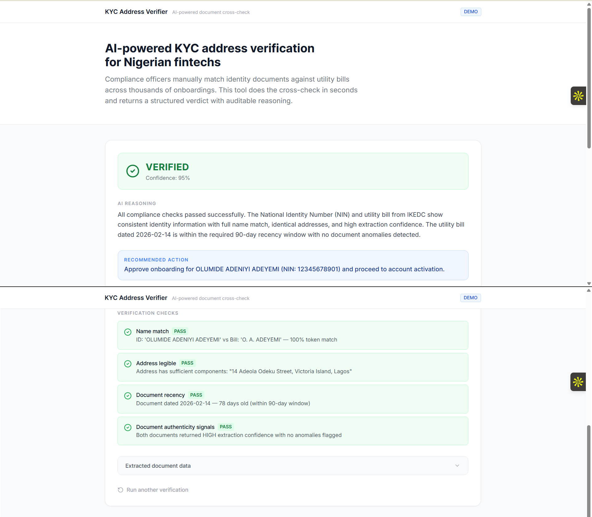
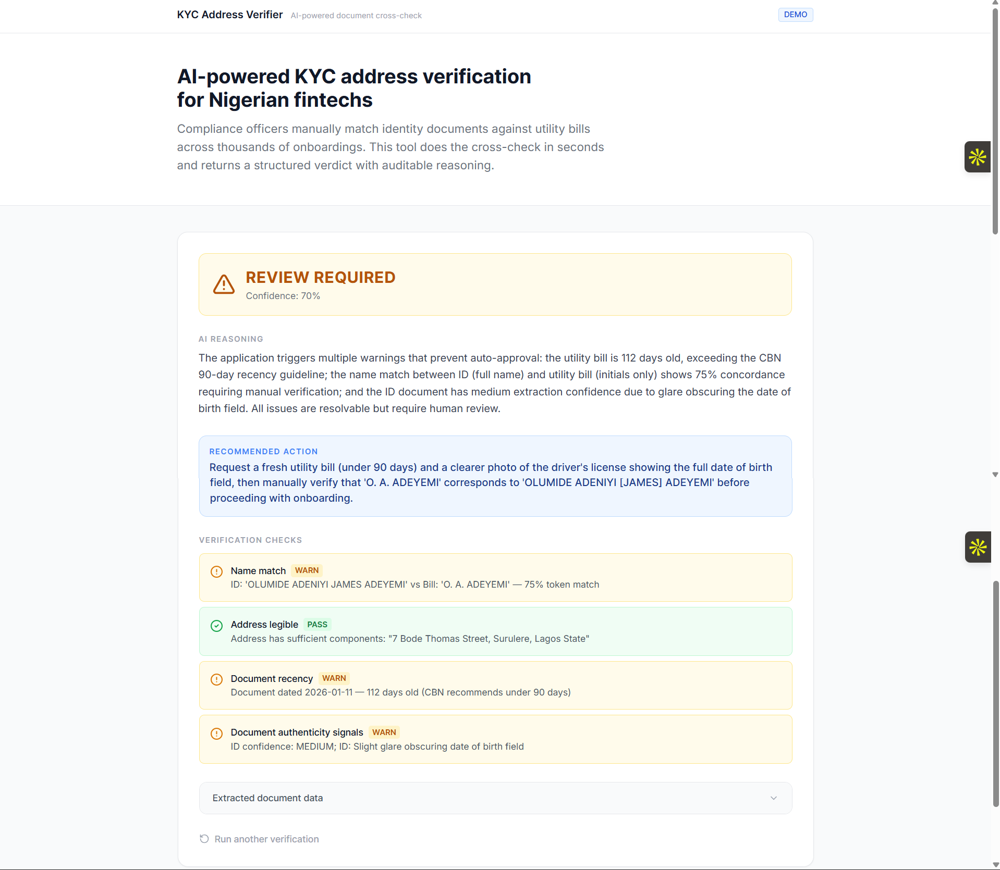
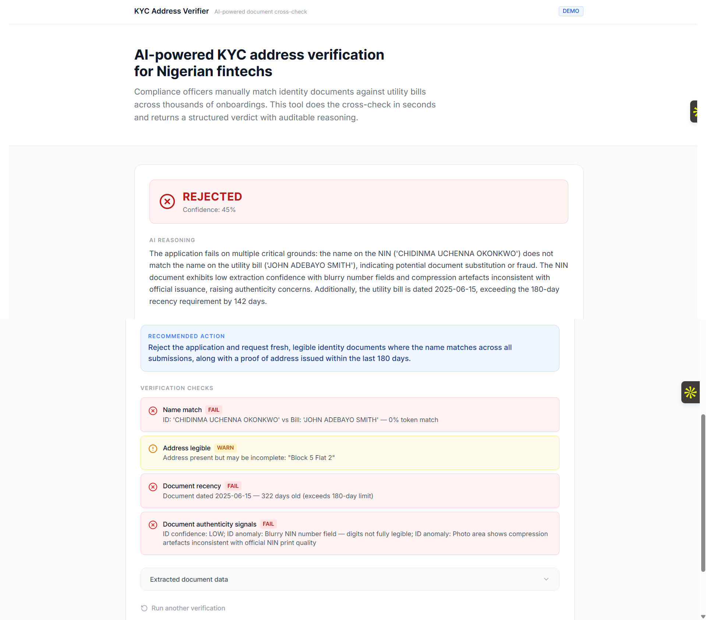

# KYC Address Verifier

**AI-powered KYC document cross-checking for Nigerian fintechs.**  
Upload an identity document and a proof of address — the system extracts structured fields using Claude vision, runs seven deterministic compliance checks, grounds the verdict in specific CBN regulations via a RAG layer, and returns an auditable result in under 10 seconds.

**Live demo:** https://kyc-address-verifier.vercel.app  
**Stack:** Next.js 16 · TypeScript · Claude Sonnet 4.5 · Vercel

---

| Verified | Review required | Rejected |
|:---:|:---:|:---:|
|  |  |  |
| Clean name match, recent IKEDC bill, high confidence | 4-token name partial match, 110-day-old bill, DL with glare | Name mismatch, incomplete address, two authenticity anomalies |

---

## Problem

Nigerian fintechs are required by the Central Bank of Nigeria to verify customer addresses before granting Tier 2 and Tier 3 account privileges — higher transaction limits, lending products, and cross-border transfers. In practice, this means compliance officers manually comparing identity documents against utility bills across thousands of onboardings daily.

The manual process has three compounding problems:

**It doesn't scale.** A compliance team reviewing KYC manually at the rate of 5 minutes per submission cannot keep up with a fintech onboarding 10,000 users a day. Backlogs delay activation, and delayed activation kills conversion.

**It introduces inconsistency.** Whether a document passes depends on who reviews it and when. A name like "Olumide A. Adeyemi" on a utility bill might pass review on a Tuesday and fail on a Friday. There is no audit trail for why.

**It misses structured compliance signals.** A compliance officer doing a manual review doesn't typically check whether the document's issue date is within the CBN's 90-day window, whether the NIN has the right format, or whether the ID expiry date has passed. These are binary rules that can be enforced deterministically — but only if the system actually checks them.

---

## Solution

The KYC Address Verifier automates the first-pass document cross-check, producing a structured verdict that is:

- **Auditable** — every decision traces back to named checks with explicit pass/fail/warn states
- **Grounded** — verdict reasoning cites the specific CBN/NIMC regulation that applies
- **Deterministic where it should be** — recency windows, NIN format, ID expiry are rule-based, not AI-generated
- **AI-assisted where rules break down** — name matching across Nigerian naming conventions, anomaly detection, reasoning synthesis

The system compresses the compliance officer's first-pass review from minutes to seconds. It does not replace human judgment — it focuses it. The output is designed to be actioned in one click or escalated in one sentence.

---

## Pipeline

```
Upload (ID document + Proof of Address)
                │
                ▼
   ┌────────────────────────┐
   │  Stage 1: AI Extraction │  Claude Vision × 2 (parallel)
   │  ~3–5 seconds          │  → Structured JSON: name, DOB, address,
   └────────────────────────┘    id_number, expiry, confidence, anomalies
                │
                ▼
   ┌────────────────────────┐
   │  Stage 2: Deterministic │  lib/verification.ts — 7 checks, ~0ms
   │  Compliance Checks     │  → checkNameMatch (token overlap, prefix-aware)
   └────────────────────────┘  → checkAddressLegibility (structural heuristic)
                │               → checkDocumentRecency (CBN 90/180-day windows)
                │               → checkAuthenticity (confidence × anomaly count)
                │               → checkIDExpiry (date comparison)
                │               → checkIDNumberFormat (NIN/DL regex)
                │               → checkAddressCrossMatch (state/city token comparison)
                ▼
   ┌────────────────────────┐
   │  Stage 2.5: RAG        │  lib/rag.ts — TF-IDF, ~1ms
   │  Compliance Retrieval  │  15-chunk CBN/NIMC knowledge base
   └────────────────────────┘  → top-4 regulation chunks ranked by case context
                │
                ▼
   ┌────────────────────────┐
   │  Stage 3: AI Verdict   │  Claude Sonnet 4.5 — 1 reasoning call
   │  Reasoning             │  → 2–3 sentence compliance reasoning
   └────────────────────────┘  → recommended action for onboarding officer
                │               → regulatory citations (source, section, relevance)
                ▼
         VerificationResult
   (streamed via SSE as each stage completes)
```

---

## Technical Decisions

### Why Claude vision for extraction — not OCR or regex

Nigerian identity documents have no standardised layout. A 2024 FRSC driver's licence looks different from a 2019 one. NIN slips differ by state. Bank statements differ by institution. Template-based OCR fails on novel layouts and requires per-issuer maintenance.

Claude vision handles degraded scans, varying print quality, and diverse templates without per-template rules. It also returns `extraction_confidence` and an `anomalies` array — signals the deterministic layer uses directly. A regex pipeline can't tell you "there's a font inconsistency in the date field."

### Why deterministic checks on top of AI extraction

Compliance rules are binary. The CBN's 90-day recency requirement isn't a matter of judgment — a bill dated 91 days ago either passes or doesn't. Running these as AI prompts would introduce hallucination risk on rules that are black-and-white. The deterministic layer:

- Cannot hallucinate (it's a date comparison and a regex test)
- Produces named, auditable check results that regulators can inspect
- Runs in ~0ms vs another AI call

The AI's job is extraction (reading documents) and synthesis (writing the reasoning). The deterministic layer's job is rules enforcement.

### Why a RAG layer for compliance reasoning

Without grounding, Claude's verdict reasoning says things like "the document does not meet recency requirements." With the RAG layer, it says "this bill falls outside the 90-day window required under CBN Guidelines on Mobile Money Services (Revised) 2015, Section 10.3 for Tier 3 KYC onboarding." The difference matters to a compliance audit trail.

The knowledge base covers CBN KYC tiers, proof-of-address requirements, NIN/DL standards, name matching tolerances, AML/CFT CDD, and document authenticity — 15 chunks retrieved by TF-IDF scoring against the verification context.

**Why TF-IDF over a vector database:** Vercel serverless functions cannot run a Chroma or Qdrant instance. A pure-TypeScript TF-IDF implementation has zero external dependencies, initialises in ~1ms, and returns the same chunks deterministically for the same query — important for a system whose outputs go into a compliance audit trail. The retrieval engine is a direct drop-in for dense embeddings when this moves to production.

### Why SSE over a single JSON response

Three sequential AI calls take 5–10 seconds total. A single HTTP response would leave the user staring at a spinner with no feedback. SSE emits a `stage` event as each step completes (`extracting` → `checking` → `reasoning`), so the progress indicator in the UI advances in real time.

### Why separate comparison and compliance sub-modules

All Nigeria-specific knowledge — document type definitions, honorific title list, utility provider names, CBN recency windows, NIN format regex, Nigerian state and city names — lives in a single file: `lib/config/nigeria.ts`. The comparison logic in `lib/comparison/` and compliance rules in `lib/compliance/` are jurisdiction-agnostic. Swapping the config is the only change needed to adapt the pipeline to another country's documents.

---

## Evaluation

The system was evaluated against 22 hand-crafted test cases covering clean matches, partial matches, mismatches, and edge cases specific to Nigerian naming conventions and document patterns.

### Verdict accuracy by version

| Version | Verdict accuracy | Notes |
|---|---|---|
| v1.0 (baseline) | 16 / 22 (72.7%) | 6 failures identified |
| v1.1 (Phase B) | 21 / 22 (95.5%) | +22.8pp — 5 of 6 failures fixed |
| v1.2 (Phase D) | **22 / 22 (100.0%)** | TC-020 closed with `checkAddressCrossMatch` |

### Check accuracy (v1.2)

| Check | Accuracy |
|---|---|
| Name match | 22/22 (100%) |
| Address legibility | 22/22 (100%) |
| Document recency | 22/22 (100%) |
| Authenticity signals | 22/22 (100%) |
| ID document expiry | 22/22 (100%) |
| ID number format | 22/22 (100%) |
| Address cross-match | 22/22 (100%) |

### RAG retrieval accuracy

15 retrieval eval cases, each specifying which compliance chunk must appear in the top-4 results: **15/15 (100%)**. Key required chunk ranked #1 in 14/15 cases.

### Category breakdown (v1.2)

| Category | Cases | Pass rate |
|---|---|---|
| Clean matches | 5 | 5/5 (100%) |
| Partial matches / review | 5 | 5/5 (100%) |
| Mismatches / rejection | 5 | 5/5 (100%) |
| Edge cases | 7 | 7/7 (100%) |

### What the baseline failures revealed

The 6 baseline failures split into three patterns — all fixable, all fixed:

| Pattern | Cases | Impact | Fix |
|---|---|---|---|
| Nigerian naming conventions not handled | TC-008, TC-017, TC-021 | False rejections of legitimate customers | Expanded title regex (20+ titles), hyphen-to-space normalisation, WARN threshold 0.7 → 0.6 |
| Extracted fields not validated | TC-012, TC-015 | False verifications — expired ID, invalid NIN format | Added `checkIDExpiry()` and `checkIDNumberFormat()` |
| No cross-document address comparison | TC-020 | Address fraud signal missed | Added `checkAddressCrossMatch()` with Nigerian state/city token extraction |

Full failure analysis: [`docs/eval-results.md`](docs/eval-results.md)  
Run the eval: `npm run eval`

---

## Sample verdicts

**VERIFIED — clean match, recent IKEDC bill**
```json
{
  "decision": "VERIFIED",
  "confidence": 0.95,
  "reasoning": "The NIN slip and IKEDC electricity bill belong to the same individual. The abbreviated name on the bill (O. A. ADEYEMI) is consistent with the full name on the ID (OLUMIDE ADENIYI ADEYEMI) — a standard pattern on Nigerian utility accounts, acceptable under CBN eKYC Guidelines 2023, Section 6.2. The bill is 49 days old, within the 90-day window required under CBN Guidelines on Mobile Money Services 2015, Section 10.3.",
  "recommended_action": "Approve KYC Tier 3 upgrade for Olumide Adeniyi Adeyemi. No manual review required.",
  "regulatory_context": [
    { "source": "CBN Guidelines on Mobile Money Services (Revised), 2015 — Appendix II", "section": "Tier 3 Account: Full KYC Requirements" },
    { "source": "CBN AML/CFT Regulations 2022 — Regulation 14(3)", "section": "Customer Name Matching: Standards and Tolerances" }
  ]
}
```

**REVIEW_REQUIRED — partial name match + borderline bill age**
```json
{
  "decision": "REVIEW_REQUIRED",
  "confidence": 0.68,
  "reasoning": "The name on the PHCN bill ('O. A. ADEYEMI') partially matches the driver's licence ('OLUMIDE ADENIYI JAMES ADEYEMI') — surname present, first name reduced to an initial. Under CBN AML/CFT Regulations 2022, Regulation 14(3), abbreviated first names are acceptable if clearly traceable to the same individual, so this alone would not reject. However, the bill is dated 11 January 2026 (110 days old), exceeding the 90-day threshold under CBN Guidelines 2015, Section 10.3. Either factor warrants review.",
  "recommended_action": "Escalate to manual KYC review. Request a replacement proof of address issued within the last 90 days, or a second document showing the full given name."
}
```

**REJECTED — name mismatch + authenticity anomalies**
```json
{
  "decision": "REJECTED",
  "confidence": 0.31,
  "reasoning": "The name on the DSTV subscription bill ('JOHN ADEBAYO SMITH') does not match the NIN slip ('CHIDINMA UCHENNA OKONKWO') — zero shared name tokens. Under CBN AML/CFT Regulations 2022, Regulation 14(3), a complete mismatch must be treated as a FAIL and escalated. Separately, the NIN slip returned LOW extraction confidence with two anomalies: a blurry ID number field and compression artefacts inconsistent with official NIMC print quality, triggering Enhanced Due Diligence review under Regulation 13.",
  "recommended_action": "Reject KYC submission. Applicant must resubmit a utility bill in their registered name with a complete address, issued within the last 90 days. Flag for potential identity fraud review."
}
```

---

## Failure modes and known limitations

The system is a prototype, not a production KYC system. Before deployment, the following gaps must be addressed:

**What it cannot detect:**
- A real document photographed next to a fake one — there is no liveness check
- Informal name shortenings that are not prefixes: "Tunde" will not match "Babatunde" since neither is a prefix of the other
- PDF documents (JPG and PNG only; PDF rejected with a clear error)
- NIN validity against the NIMC national database (only format is checked; the number could be fabricated)

**Where it degrades:**
- Very low resolution or heavily glared images lower extraction confidence and trigger authenticity warnings even on genuine documents
- Documents with deliberate watermarks or heavy background patterns sometimes cause anomaly false-positives
- Unusual utility providers not in the recognised list may not be rated with full confidence

**What requires human judgment:**
- Address cross-match WARN (person may have genuinely moved)
- Name match WARN (abbreviation vs. different person requires a compliance officer to confirm)
- Authenticity WARN with a single anomaly (could be print quality, could be tampering)

Full failure mode catalogue with impact ratings: [`docs/failure-modes.md`](docs/failure-modes.md)

---

## Codebase structure

```
lib/
├── config/nigeria.ts        # All Nigeria-specific knowledge (titles, providers,
│                            # CBN rules, state/city lists, format regexes)
├── comparison/
│   ├── similarity.ts        # normalizeName, tokenOverlap, extractLocationTokens
│   └── comparator.ts        # checkNameMatch, checkAddressLegibility,
│                            # checkDocumentRecency, checkAddressCrossMatch
├── compliance/
│   ├── rules.ts             # checkAuthenticity, checkIDExpiry, checkIDNumberFormat
│   └── rag.ts               # re-export facade for lib/rag.ts
├── verification.ts          # Thin facade: runChecks(), aggregateDecision()
├── anthropic.ts             # Claude API — extraction + reasoning with retry
├── prompts.ts               # All prompt templates (versioned, v1.2)
├── rag.ts                   # TF-IDF KB: 15 CBN/NIMC compliance chunks
└── types.ts                 # Shared TypeScript types
```

Swapping `lib/config/nigeria.ts` with another country's equivalent is the only change needed to adapt the pipeline to a new jurisdiction. Full architecture guide: [`docs/architecture.md`](docs/architecture.md)

---

## Local setup

```bash
git clone https://github.com/oludami23/kyc-address-verifier.git
cd kyc-address-verifier
npm install

# Add your Anthropic API key
echo "ANTHROPIC_API_KEY=sk-ant-..." > .env.local

npm run dev
# → http://localhost:3000
```

The three demo scenario buttons (Try: Verified / Review / Rejected) work without a real document upload — they use pre-set mock extractions and run one real reasoning call. Real document upload requires a valid API key.

### Running the eval harnesses

```bash
# Verification pipeline eval (22 test cases)
npm run eval

# RAG retrieval eval (15 retrieval cases)
npm run eval:rag
```

Both evals run without any API key — they exercise the deterministic and retrieval layers only.

---

## What would change for production

This prototype demonstrates the approach. A production version would require:

1. **NIMC API integration** — verify NIN numbers against the national identity database in real time rather than format-checking only
2. **BVN cross-check** — validate bank statement submissions against the Bank Verification Number registry
3. **PDF support** — server-side PDF-to-image conversion before extraction
4. **Audit log** — tamper-evident verdict storage with full extraction payloads for CBN examination
5. **Phonetic name matching** — handle informal shortenings ("Tunde" ↔ "Babatunde") and Yoruba/Igbo/Hausa transliteration variants not covered by prefix matching
6. **Dense embedding RAG** — replace TF-IDF with Voyage AI embeddings and a Chroma/Qdrant vector store for semantic retrieval across paraphrased regulatory text
7. **Batch processing** — queue-based pipeline for compliance teams reviewing high volumes
8. **Multi-country config** — the architecture already isolates Nigeria-specific knowledge in `lib/config/nigeria.ts`; Kenya, Ghana, or South Africa would require only a new config file

---

## Prompt versioning

Prompts are versioned in `/prompts/` with a full changelog:

| Version | Date | Key changes |
|---|---|---|
| v1.0 | Phase A | Baseline — extraction + verdict |
| v1.1 | Phase B | Title stripping instructions, expiry/format anomaly guidance, CBN citation requirement, Nigerian naming guidance |
| v1.2 | Phase D | Regulatory context injection (RAG chunks in prompt), strengthened citation instruction |

---

**Author:** Olumide Adeniyi — [LinkedIn](https://linkedin.com/in/olumide-adeniyi/)  
Part of an ongoing exploration into how AI can compress compliance workflows in African fintech without removing the audit trail regulators require.
